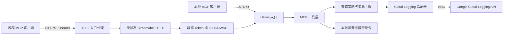

# Helios 架构设计

## 1. 目标

Helios 为 MCP 客户端提供统一、只读、受控的 Google Cloud Logging 查询能力，主要服务于以下工作流：

- 服务监控：快速查看指定时间范围和服务的错误趋势。
- 问题排查：从 Trace ID 汇集相关日志，重建请求上下文。
- 事件分诊：对日志样本生成摘要，对异常进行指纹聚合和排序。
- 团队共享：通过强制认证的 Streamable HTTP 端点提供远程访问。

非目标包括日志写入/删除、实时 tail、告警策略管理、完整日志分析仓库、分布式追踪后端，以及由 Helios 充当 OAuth/OIDC 身份提供商。

## 2. 技术选型

| 领域 | 选择 | 原因 |
| --- | --- | --- |
| 语言与运行时 | TypeScript + Node.js 20+，ESM | 与 MCP 官方 TypeScript SDK 原生匹配；异步 I/O 成熟；严格类型检查 |
| MCP | `@modelcontextprotocol/sdk` 1.29.0 | 官方 SDK；同时支持 STDIO 和推荐的 Streamable HTTP |
| Cloud Logging | `@google-cloud/logging` 11.3.0 | Google 官方稳定客户端；默认集成 ADC、重试和 API 类型 |
| HTTP | Express 5.2.1 | MCP SDK 提供 Express 集成；生态和运维模型成熟 |
| 身份认证 | 静态 Bearer Token；JOSE OIDC/JWKS | 覆盖本地/小团队和企业身份提供商两类部署 |
| 校验 | Zod 4.4.3 | MCP SDK 的必需 peer dependency；统一工具输入和配置校验 |
| 测试 | Vitest 4.1.10 | 适合 ESM TypeScript，支持覆盖率和快速单元测试 |
| 交付 | npm lockfile + 多阶段 Docker | 可重复安装；运行镜像不包含编译工具和测试依赖 |

选择无状态 Streamable HTTP 是有意的：日志查询天然是独立的请求/响应操作，不需要 MCP Session、事件回放或服务器主动通知。无状态模式减少内存状态，允许负载均衡器把任意请求路由到任意实例。

## 3. 系统上下文



信任边界：

1. STDIO 信任本机用户和拉起进程的 MCP 客户端，不额外验证调用者。
2. HTTP 请求必须先通过 Bearer 身份认证和 Origin 策略，再进入 MCP 处理器。
3. Google Cloud 授权由 ADC 主体的 IAM 权限决定；Helios 不提升权限。
4. Cloud Logging 返回的数据离开 Google Cloud 后会进入 MCP 客户端和模型上下文，数据治理需要覆盖整个链路。

## 4. 组件职责

### 4.1 配置与入口

- 从环境变量和 `--transport` 参数加载配置。
- 对数字范围、URL、认证模式和必需字段做启动时校验。
- CLI 参数只覆盖传输模式；其余配置来自环境。
- STDIO 下所有诊断输出写入 `stderr`，避免污染协议 `stdout`。
- 处理 `SIGINT`/`SIGTERM`，停止接受新请求并关闭传输。

### 4.2 传输

STDIO 使用单个进程级 MCP Server 和 `StdioServerTransport`。生命周期由客户端管理，适合桌面客户端、IDE 和本地自动化。

HTTP 使用 `StreamableHTTPServerTransport`，不生成 Session ID。每个请求创建隔离的 Server/Transport 上下文，请求结束后关闭。GET 和 DELETE 不用于建立长期 SSE Session；该部署模型不提供跨请求恢复能力。

HTTP 入口负责：

- 强制 `Authorization: Bearer ...`。
- 只在配置的 MCP 路径接受 POST；同路径的 GET/DELETE 仍经过认证，认证成功后返回 405。
- 检查浏览器 `Origin` 允许列表，减少 DNS rebinding 和跨站调用风险。
- 检查 `Host` 允许列表；绑定 `0.0.0.0` 或 `::` 时配置必须显式提供该列表。
- 拒绝错误的内容类型、无效 JSON 和超出入口限制的请求。
- 返回标准 JSON-RPC/MCP 错误，不泄露 Token、JWT 或内部堆栈。

`/healthz` 和 `/readyz` 为编排器提供最小健康状态；OIDC 模式通过 `/.well-known/oauth-protected-resource{HELIOS_HTTP_PATH}` 发布受保护资源元数据。静态 Token 模式不发布 OAuth discovery 挑战。上述端点不返回日志内容或认证秘密。

生产环境必须在 Helios 前终止 TLS。Helios 内部执行认证前 IP 固定窗口限流、每身份/每工具限流和全局查询并发限制；反向代理或平台入口仍应提供分布式限流与请求体保护。

### 4.3 认证

静态模式将 `HELIOS_HTTP_STATIC_TOKENS_JSON` 解析为“调用者标识 -> Token”映射。比较 Token 时应使用恒定时间比较，日志只记录调用者标识，不记录 Token。

OIDC 模式将 Helios 作为资源服务器：

- 仅从明确配置的 `HELIOS_OIDC_JWKS_URI` 获取公钥。
- 仅允许 `HELIOS_OIDC_ALGORITHMS` 中的非对称算法。
- 验证签名、`iss`、`aud`、`exp` 和可选必需 scope，并由 JOSE 处理密钥轮换缓存。
- 以稳定主体声明作为审计身份；不把未验证声明用于授权决策。

OIDC 模式不是完整的 MCP OAuth 授权服务器实现。身份提供商负责认证用户、客户端注册和 Token 签发；Helios 只校验访问 Token，并通过 RFC 9728 路径发布受保护资源元数据。授权服务器自身的 discovery、登录和授权流程仍由现有身份提供商或 API Gateway 提供。

### 4.4 Cloud Logging 访问

Cloud Logging 适配器使用 `@google-cloud/logging`，不显式加载自定义 Google 密钥。ADC 根据运行环境选择用户凭据、`GOOGLE_APPLICATION_CREDENTIALS`、附加服务账号或 Workload Identity。

查询过程：

1. 合并工具参数与默认项目，并验证项目列表非空。
2. 解析绝对 ISO 8601 时间，拒绝反向区间和超出最大窗口的查询。
3. 将 Trace ID、服务选择器、最低严重级别、资源类型和 `searchText` 组合为 Cloud Logging filter。
4. 对所有用户值进行 Logging 查询语言字符串转义；当前版本不接受调用者提供的任意原始 filter。
5. 调用 Cloud Logging API，并应用条数、扫描数和超时上限。
6. 将不同 payload 类型归一化为稳定的 MCP 结果对象。
7. 应用响应字节上限，返回截断标记，而不是生成超大模型上下文。

Google API 的重试只适用于客户端库判定为可重试的瞬时错误。Helios 的总超时是更高层的硬边界；权限错误、无效过滤器和配置错误不应重试。

### 4.5 工具层

`query_logs` 返回排序后的归一化日志条目，适合精确筛选和人工排查。

`get_trace_logs` 以 Trace ID 为主要条件，补充项目和时间边界，返回时间线式结果。Trace 字段通常为 `projects/{project}/traces/{traceId}`；若源日志未填充结构化 trace 字段，Helios 不做任意全文推断。

`summarize_logs` 在最多 `HELIOS_MAX_SCAN_ENTRIES` 条日志上计算严重级别分布、服务分布、资源类型分布和实际观测时间范围。它是确定性统计，不生成自然语言推断，也不声称覆盖超出扫描上限的日志。

`aggregate_exceptions` 从结构化异常、堆栈或错误消息提取异常候选，归一化易变片段后形成指纹。每组包含计数、首次/末次时间和受限样本。指纹是排查辅助，不是稳定的业务错误 ID。

四个工具共享 `projectIds`、绝对时间或 `lookbackMinutes`、结构化 `service`、`traceId`、`minSeverity`、`resourceTypes` 和 `searchText`。查询/Trace 工具增加分页、顺序、limit 和 payload 开关；摘要增加扫描上限和服务 Top N；异常聚合增加严重级别策略、分组数和每组样本数。服务端始终将请求值限制在配置预算之内。

## 5. 查询安全与资源预算

服务端配置定义不可由 MCP 参数突破的预算：

| 预算 | 默认值 | 保护目标 |
| --- | --- | --- |
| 最大查询窗口 | 168 小时 | 防止无界历史扫描 |
| 最大返回条目 | 200（可配置至 1000） | 限制 API 分页和模型上下文 |
| 最大聚合扫描条目 | 5000 | 限制 CPU、内存和 API 用量 |
| 单条日志阈值 | 16,000 字节 | 超限时压缩为异常、Trace 和检索元数据 |
| 最大响应体 | 1,000,000 字节 | 防止超大 MCP 响应 |
| 查询超时 | 30 秒 | 限制挂起请求和实例占用 |

预算应采用“服务端上限与请求值取较小值”的方式执行。任何截断都必须在结构化结果中可见，包括返回/扫描条数、是否截断和有效时间范围。不能把局部样本统计描述成全量精确统计。

Cloud Logging 的过滤器性能取决于字段和范围。运维准则是先缩小项目和时间，再使用 `resource.type`、日志名、Trace、服务标签和严重级别等可索引字段，最后才添加 payload 全文条件。

## 6. IAM 与 ADC

最小权限基线是每个目标项目上的 `roles/logging.viewer`。Data Access 审计日志需要更敏感的 `roles/logging.privateLogViewer`，应独立审批。Google Cloud 对 Log View 提供更细粒度的 `roles/logging.viewAccessor`，但当前适配器只构造项目级 resource name，工具也只接受项目 ID；支持 View 级 resource name 后才能把该角色作为可验证的最小权限边界。

推荐凭据模型：

| 环境 | ADC 来源 | 建议 |
| --- | --- | --- |
| 开发机 | `gcloud auth application-default login` | 使用个人身份和独立 quota project；不要复制到仓库 |
| 本地 Docker | 只读 Docker Secret 挂载用户 ADC | 仅开发使用；限制文件权限，容器退出后不保留 |
| Cloud Run/GCE | 附加的用户管理服务账号 | 禁止服务账号密钥；按目标项目授予 Logs Viewer |
| GKE | Workload Identity Federation for GKE | Kubernetes ServiceAccount 映射最小权限身份 |
| 外部云/本地生产 | Workload Identity Federation | 使用短期联合凭据替代长期 JSON 私钥 |

## 7. 数据模型与截断

查询元数据保留目标项目和有效时间范围；归一化日志条目保留时间戳、接收时间、严重级别、日志名、受监控资源、labels、trace/span、HTTP 请求摘要和可选 payload。原始 payload 类型可能是 `textPayload`、`jsonPayload` 或 `protoPayload`；客户端不能假设所有条目都有字符串消息。

响应序列化后若超过 `HELIOS_MAX_RESPONSE_BYTES`，优先减少样本和条目数量，并保留汇总元数据。禁止简单切断 JSON 字节串，因为那会生成无效 MCP 结果。

## 8. 错误模型

错误按边界分类：

- 配置错误：启动失败，给出环境变量名但不回显秘密值。
- 输入错误：MCP 工具错误，指出字段和允许范围。
- 认证错误：HTTP `401`；已认证但入口策略拒绝时使用 `403`。
- Google IAM/API 错误：保留可操作的状态码和安全消息，隐藏凭据及内部对象。
- 超时/上游不可用：返回可重试提示，但不在 Helios 内无限重试。
- 预算截断：成功响应加明确截断元数据，不伪装为错误或完整结果。

## 9. 部署模型

Docker 镜像包含编译后的 `dist` 和生产依赖，以 `node` 非 root 用户运行。Compose 默认：

- 容器监听 `0.0.0.0`，宿主机只绑定 `127.0.0.1`。
- 根文件系统只读，`/tmp` 使用 `tmpfs`。
- ADC 通过只读 Docker Secret 挂载。
- HTTP 认证配置通过 `.env` 注入；生产环境应改用 Secret Manager。

公网部署需要托管 HTTPS、网络访问控制、速率限制、Secret 注入和最小权限工作负载身份。无状态实例可以水平扩展；当前没有共享 Session 存储需求。

## 10. 可观测性

Helios 自身日志不应包含 Cloud Logging 完整 payload、Bearer Token 或 JWT。建议记录：

- 请求 ID、认证主体、工具名和目标项目数量。
- 查询时间窗口、有效 limit、扫描/返回条数、截断状态和耗时。
- Google API 状态码和安全的错误类别。
- HTTP 认证失败计数、查询超时计数和响应大小分布。

STDIO 和 HTTP 模式的结构化诊断日志都输出到 `stderr`；STDIO 的 `stdout` 专用于 MCP 协议。容器平台应同时采集标准错误流。避免让 Helios 查询自身日志时形成无界递归排查流程。

## 11. 验证策略

自动化测试分层：

1. 配置测试：默认值、边界、非法 URL、缺失 HTTP 认证和 CLI 优先级。
2. 过滤器测试：时间、Trace、服务、严重级别和字符串转义。
3. 归一化测试：text/json/proto payload、缺失字段和大对象。
4. 聚合测试：异常指纹、排序、样本限制和截断元数据。
5. 认证测试：静态 Token、错误 Token、OIDC 签名、audience、有效期处理和 JWKS 读取。
6. 传输测试：STDIO 协议输出隔离；HTTP 未认证拒绝、CORS、认证前 429 和无状态 MCP 请求。
7. 适配器测试：使用假 Cloud Logging 客户端验证分页、超时和错误映射，不依赖真实云资源。

真实 GCP 验证应作为显式 smoke test，在专用项目和短时间窗口运行，不进入默认单元测试。验证前确认 API、IAM、ADC 和预算告警，测试后审查 Cloud Audit Logs。

标准本地验证命令：

```powershell
npm ci
npm run check
npm test
npm run test:coverage
npm run build
```

## 12. 主要权衡和后续演进

- 无状态 HTTP 换取简单扩展，但放弃 MCP Session、服务器通知和恢复流。
- 本地聚合实现简单且保护数据边界，但只覆盖扫描上限内的样本。需要精确大规模统计时，应使用 Log Analytics/BigQuery，而不是提高 MCP 返回上限。
- 静态 Token 部署容易，但缺少细粒度声明和集中撤销体验；生产默认应迁移到 OIDC。
- 当前工具级授权一致。未来多租户场景需要把认证主体映射到允许的项目/过滤器，并在服务端强制执行，不能依赖模型提示。
- 若 MCP 客户端需要端到端 OAuth 登录、动态客户端注册或授权服务器元数据，应与成熟身份提供商/API Gateway 集成；Helios 已提供资源服务器侧 RFC 9728 元数据。

## 13. 官方依据

- [MCP TypeScript SDK](https://github.com/modelcontextprotocol/typescript-sdk)
- [MCP transport specification](https://modelcontextprotocol.io/specification/draft/basic/transports)
- [Cloud Logging Node.js client](https://cloud.google.com/nodejs/docs/reference/logging/latest)
- [Cloud Logging query language](https://cloud.google.com/logging/docs/view/logging-query-language)
- [Application Default Credentials](https://cloud.google.com/docs/authentication/application-default-credentials)
- [Cloud Logging IAM](https://cloud.google.com/iam/docs/roles-permissions/logging)
- [Cloud Logging quotas](https://cloud.google.com/logging/quotas)
- [Cloud Logging pricing](https://cloud.google.com/logging/pricing)
